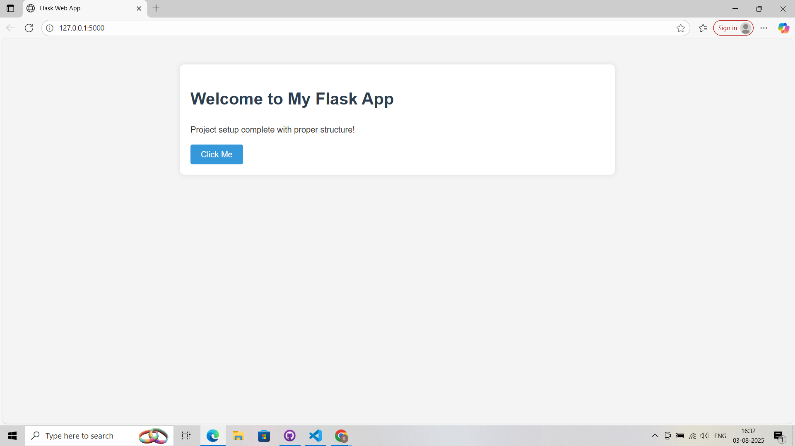
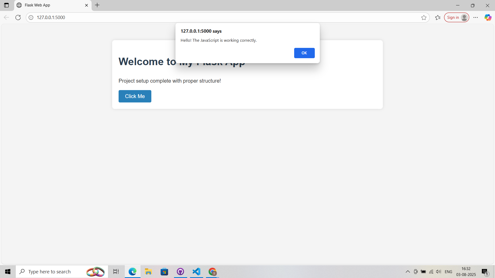

<<<<<<< HEAD

<<<<<<<< HEAD:Day1ProjectSetup/README.md
=======
# 30-Days-of-AI-Voice-Agents #Day 1 Project Setup

>>>>>>> 42f02dace0a1633162cbd9c6dd27f08f375eaea5
# Flask Web Application

A basic Flask web application with proper project structure.

## Features

- Flask backend server
- HTML templates
- CSS styling
- JavaScript functionality
- Organized project structure

## Setup

1. Clone the repository
2. Create a virtual environment:
   ```bash
   python -m venv venv
   ```
3. Activate the virtual environment:
   - Windows: `venv\Scripts\activate`
   - Mac/Linux: `source venv/bin/activate`
4. Install dependencies:
   ```bash
   pip install -r requirements.txt
   ```
5. Run the application:
   ```bash
   python app.py
   ```
6. Open http://localhost:5000 in your browser

# Output

<<<<<<< HEAD
!(image.png)

!(image-1.png)
========
>>>>>>>> 42f02dace0a1633162cbd9c6dd27f08f375eaea5:README.md
=======



>>>>>>> 42f02dace0a1633162cbd9c6dd27f08f375eaea5
